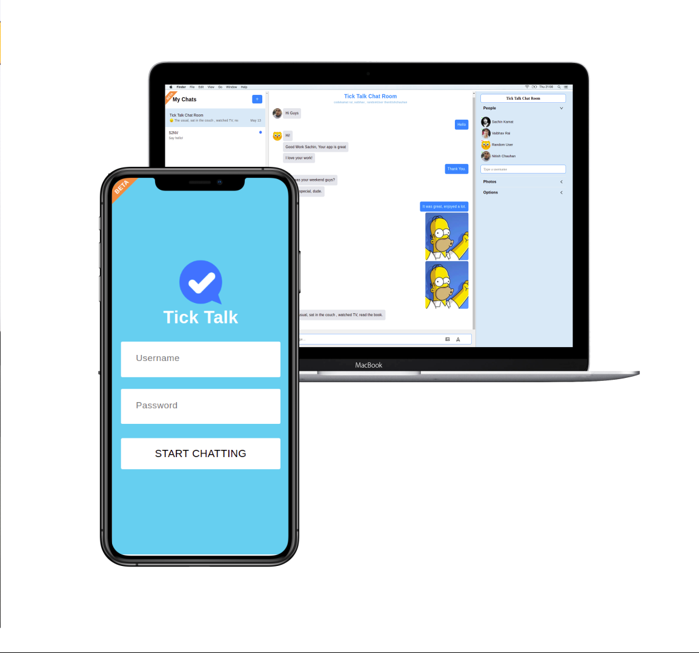

# Tick Talk

#### See Live Site: <https://ticktalk.netlify.app/>

#### Description:

Full-Fledged Chat App with online statuses, icons telling you who read the message, image support, sound notification, the ability to create multiple rooms, and much more.

The following functionalities have been added to the app-

- Create Multiple Chat Room:
- Upload Image in chat in real time:
- Talk to as many people as you want:

#### How to develop it

- Clone on your local machine by using `git@github.com:codeKAMAT/Tick-Talk.git`
- Navigate into the main directory
- Run `npm install` to install node modules
- Run `npm start` to run it locally then will open automatclly on your browser on `localhost:3000` port
- Run `npm run build` to create a production build

#### Tech Stack-

- React
- CSS
- React-hooks
- Sockets
- Chat-engine

### Demo Username and Password

#### -Demo Login

-Demo Username : `randomUser`

-Demo Password : `123123`

#### Screens :computer:

